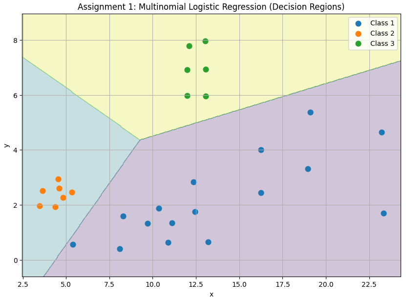
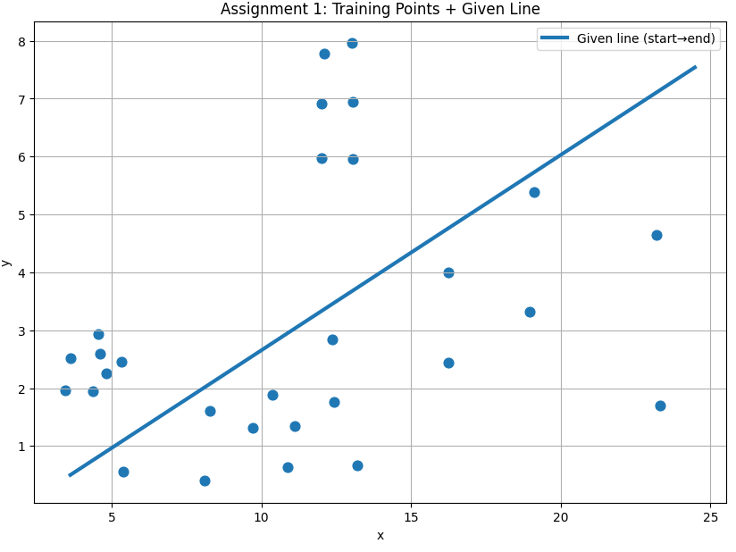

# AI & ML for Cybersecurity – Midterm Exam Retake - Nino Bukuri

## Assignment 1: Logistic Regression Model Coefficients

---

## Data Preparation

The dataset was obtained from the interactive graph provided at:

```
max.ge/aiml_midterm/11221924_html
```

Each point was assigned to a class according to the assignment definition:

- **Class 1** – all points located **below the given line**
- **Class 2** – **purple** points
- **Class 3** – **blue** points

Some points visible on the graph (e.g. orange points above the line) do not belong to any of the three defined classes.  
These points were kept in the original CSV with an empty `class` value and were **excluded programmatically** before model training.

The dataset contains only the required columns:

```
x, y, class
```

---

## Model Selection

Since the task requires classification into **three distinct classes**, a **multinomial logistic regression** model was used.

Multinomial logistic regression is suitable for multi-class classification problems where:

- each data point belongs to exactly one class, and
- class probabilities are computed using the **softmax** function.

To improve numerical stability and convergence, feature scaling was applied using **StandardScaler**.

---

## Model Training and Coefficients

The model was trained using the LBFGS optimization algorithm.  
Only points with valid class labels (1, 2, or 3) were included in the training process.

After training, the model produced:

- an **intercept** for each class, and
- a pair of coefficients corresponding to the features `x` and `y`.

These coefficients define linear decision boundaries in the (x, y) plane.  
The class with the highest predicted probability (after softmax) is selected as the final prediction.

---

## Visualization

### Decision Regions

The following figure shows the **decision regions** produced by the trained multinomial logistic regression model.  
Each region represents the class predicted by the model for that area of the (x, y) space.



---

### Training Points and Reference Line

The next figure shows the **training data points** together with the **reference line** provided in the assignment.  
This visualization confirms that:

- Class 1 points are located below the line,
- Classes 2 and 3 are separated based on learned decision boundaries.



---

## Conclusion

The multinomial logistic regression model successfully classifies the given points into the three required classes.  
The extracted coefficients and visualizations demonstrate that the model correctly captures the geometric structure of the data and provides an interpretable and reproducible solution to the classification task.

---

## Reproducibility

All code used for data processing, model training, coefficient extraction, and visualization is included in this repository.  
The results can be reproduced by running the provided Python scripts.
