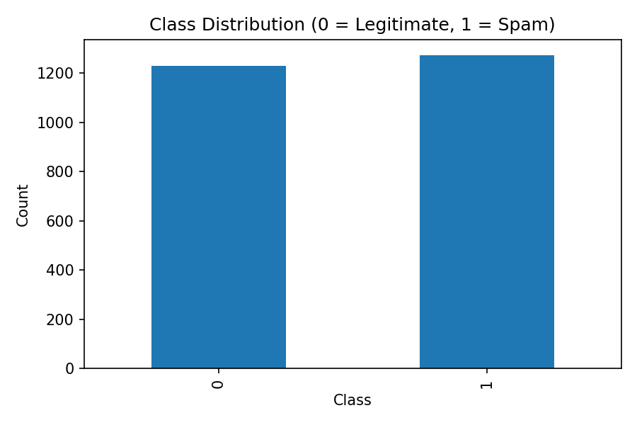
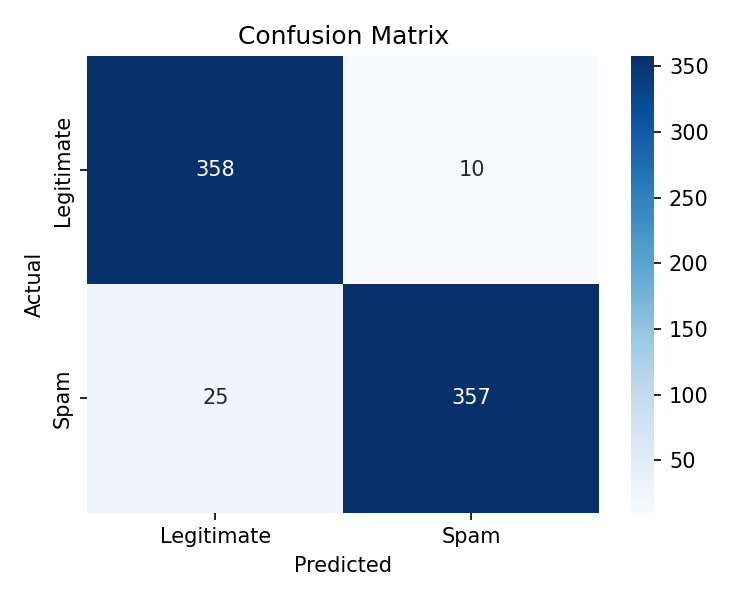

# AI & ML for Cybersecurity – Midterm Exam Retake - Nino Bukuri

## Assignment 1: Logistic Regression Model Coefficients

---

## Data Preparation

The dataset was obtained from the interactive graph provided at:

```
max.ge/aiml_midterm/11221924_html
```

Each point was assigned to a class according to the assignment definition:

- **Class 1** – all points located **below the given line**
- **Class 2** – **purple** points
- **Class 3** – **blue** points

Some points visible on the graph (e.g. orange points above the line) do not belong to any of the three defined classes.  
These points were kept in the original CSV with an empty `class` value and were **excluded programmatically** before model training.

The dataset contains only the required columns:

```
x, y, class
```

---

## Model Selection

Since the task requires classification into **three distinct classes**, a **multinomial logistic regression** model was used.

Multinomial logistic regression is suitable for multi-class classification problems where:

- each data point belongs to exactly one class, and
- class probabilities are computed using the **softmax** function.

To improve numerical stability and convergence, feature scaling was applied using **StandardScaler**.

---

## Model Training and Coefficients

The model was trained using the LBFGS optimization algorithm.  
Only points with valid class labels (1, 2, or 3) were included in the training process.

After training, the model produced:

- an **intercept** for each class, and
- a pair of coefficients corresponding to the features `x` and `y`.

These coefficients define linear decision boundaries in the (x, y) plane.  
The class with the highest predicted probability (after softmax) is selected as the final prediction.

---

## Visualization

### Decision Regions

The following figure shows the **decision regions** produced by the trained multinomial logistic regression model.  
Each region represents the class predicted by the model for that area of the (x, y) space.


---

### Training Points and Reference Line

The next figure shows the **training data points** together with the **reference line** provided in the assignment.  
This visualization confirms that:

- Class 1 points are located below the line,
- Classes 2 and 3 are separated based on learned decision boundaries.


---

## Conclusion

The multinomial logistic regression model successfully classifies the given points into the three required classes.  
The extracted coefficients and visualizations demonstrate that the model correctly captures the geometric structure of the data and provides an interpretable and reproducible solution to the classification task.

---

# Assignment 2 – Spam Email Detection

---

## Dataset Description

The dataset used in this assignment is provided in the file:

```
n_bukuri25_11221924.csv
```

It contains **2500 email samples** with the following columns:

- `words` – total number of words in the email
- `links` – number of links contained in the email
- `capital_words` – number of fully capitalized words
- `spam_word_count` – number of spam-related keywords
- `is_spam` – target label
  - `0` → legitimate email
  - `1` → spam email

---

## Model Selection

Since the task is to classify emails into **two classes (spam / legitimate)**,  
**binary logistic regression** was selected.

Logistic regression is suitable because:

- the output is binary,
- it provides interpretable coefficients,
- it produces probabilistic predictions.

Feature scaling was applied using **StandardScaler** to ensure stable training.

---

## Model Training

The dataset was split into:

- **70% training data** (1750 samples)
- **30% testing data** (750 samples)

The model was trained using the **LBFGS optimizer**.

### Learned Coefficients

The trained model produced the following coefficients:

| Feature         | Coefficient |
| --------------- | ----------- |
| words           | 1.786       |
| links           | 2.377       |
| capital_words   | 3.469       |
| spam_word_count | 2.360       |

The largest coefficient corresponds to `capital_words`, indicating that excessive capitalization is a strong indicator of spam.

---

## Model Evaluation

### Accuracy

The trained model achieved an accuracy of:

```
95.33%
```

### Confusion Matrix

The confusion matrix (rows = actual, columns = predicted):

```
[[358  10]
 [ 25 357]]
```

- 358 legitimate emails correctly classified
- 357 spam emails correctly classified
- 10 false positives
- 25 false negatives

---

## Visualizations

### Class Distribution

The following figure shows the distribution of legitimate and spam emails in the dataset:



---

### Confusion Matrix Visualization

The confusion matrix is visualized below for easier interpretation:



---

## Email Text Classification Demo

A console-based email checker was implemented.  
The email text is parsed, features are extracted, and the trained model is used for prediction.

### Spam Email Example

**Email text:**

```
URGENT WINNER NOTICE!!!
YOU HAVE WON A FREE CASH PRIZE AND EXCLUSIVE BONUS.
CLICK NOW TO CLAIM YOUR MONEY!!!
```

**Extracted features:**

- words: 44
- links: 3
- capital_words: 28
- spam_word_count: 28

**Prediction:**

```
Spam (probability ≈ 1.000)
```

---

### Legitimate Email Example

**Email text:**

```
Hi team,
Please find the meeting notes from today's sync attached.
Best regards.
```

**Extracted features:**

- words: 27
- links: 0
- capital_words: 0
- spam_word_count: 0

**Prediction:**

```
Legitimate (probability ≈ 0.000)
```

---

## Conclusion

The logistic regression model successfully detects spam emails with high accuracy.  
Both numerical evaluation and manual email testing confirm that the model captures meaningful spam characteristics such as capitalization, links, and spam-related keywords.

---

## Reproducibility

All code, data, and visualizations required to reproduce the results are included in this repository.  
The model can be re-trained and evaluated by running:

```
assignment2_spam_detection.py
```


## Reproducibility

All code used for data processing, model training, coefficient extraction, and visualization is included in this repository.  
The results can be reproduced by running the provided Python scripts.
